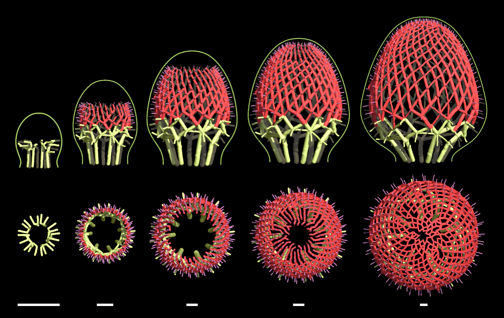

# A model of vasculature for Bellis (common daisy)



This model procedurally generates the geometry of vasculature within a growing flower head receptacle. The growth of the receptacle is modelled by interpolating the profile curves from the contour model (Zhang 2021). The phyllotaxis patterning of primordia on the growing flower head receptacle (Zhang 2021) preceeds the vascular development. Vasculature patterning within the receptacle is modeled as a process that establishes veins as paths that (abstractly) minimize the resistance of auxin flow from sources (incipient primordia) to sinks (established vasculature connecting to the procambrial ring). This minimal resistance path through both ground tissue and prior vasculature is patterned as a new vasculature connection from the incipient primordia to the emergent vasculature.

The conspicuous reticulation patterns of Bellis are patterned in two phases. First, a single vascular strand is exteneds from an incipient primordium such that it follows the minimal resistance path along a single family of parastichies; then a second vascular strand extends from the primordium along the second parastichy family. The resistance calculation is modulated to account for the relative age of neighbouring vasculature (and primordium) when calculating the minimal resistance path, this was crucial to patterning along dedicated families of parastiches.

The vascular model produces:
1. The procambrial ring (auxin sinks) at the base of the receptacle
2. Abaxial veins (yellow) connecting incipient bract veins to the procambrial ring and each other
3. Floret veins (purple, regular) connecting incipient floret primordia veins to the established vasculature
4. Reticulating vasculature (red) which first patterns vasculature (predominantely) along a single parastichy family of floret primordia; then, after some time, the opposite family of parastiches is patterned creating the reticulation pattern.

Several components of the model are precomputed and stored as file inputs to the model.

## Phyllotaxis (*.prims) 
The phllotaxis patterning of incipient primordia produces by an accompanying [Bellis phyllotaxis model](https://github.com/AlgorithmicBotany/head-vasculature-models/blob/main/oofs/ext/Bellis-Phyllotaxis/README.md#a-model-of-phyllotaxis-for-bellis-common-daisy). The primordia positions on the receptacle are precomputed and stored as a text file (*.prims) input to the vasculature model. It lists the timestamped position (on the developing receptacle) that primordia was patterned.

### Format
```
# of primordia
{id} {frame inserted} {arclength position from tip} {azimuth on receptacle} {type 0 bract, 1 trans, 2 floret}
```

## Receptacle development and harmonic weights for deformation (*.raw)
The receptacle develops in shape as a sequence of sampled flower head contours. The vasculature deforms within the receptacle using cage-based modelling, where the development of the countour smoothly deforms the vasculature. We calculate associated weights (Harmonic coordinates, Joshi 2007) from the contour to the receptacle interior, allowing us to deform the vasculature as a function of the deforming receptacle contour. 

Computing the weight fields of each contour requires solving a series of Laplace equations with an approriately discritized receptacle interior. We model the receptacle as a surface of revolution, and, therefore, the interior as a `volume of revolution'. The contours are (delauny) triangulated using the [Triangle](https://www.cs.cmu.edu/~quake/triangle.html) library, generating domain for the weight fields; the harmonic coordinates are calculated on this domain using the Eigen math library.

A binary file (*.raw) stores the precomputed harmonic coordinates (weight fields) and the cage control points defining the contour and interior of the receptacle. For each developmental step of the receptacle there exists a cage of control points defining the countour and boundary of the current radial longitudinal section of the receptacle. A scalar weight field over interior of this 2-dimensional boundary is precomputed for each control point. For any given point in the domain, the contributions of all control point weights at that point sum to 1, providing an affine coordinate system of the point defined in terms of the control point positions. As the control point position change with each iteration, the vasculautre deforms as a function of the contour control points. Many small steps of the receptacle development, and the accompanying control points and harmonic weight fields, are precomputed. The file stores this information in binary for smaller file size.

**NOTE** The binary file **bellis_contours_weights.raw** (100MB) must be downloaded separately at [algorithmicbotany.org](http://algorithmicbotany.org/).

### Format
```
# of receptacle development frames
// for each frame
// -field (triangle mesh) information
// -control point information
// -weight fields (scalar per vertex) per control point
# of vertices
{x pos} {y pos}
...
# of faces
{vertex a ID} {vertex b ID} {vertex c ID}
...
# of control points
{x pos} {y pos}
...
// for each control point, scalar per vertex
{w weight at vertex}
...
```

## References
```
@article{2021ZhangPNAS,
       author = {{Zhang}, Teng and {Cieslak}, Mikolaj and {Owens}, Andrew and {Wang}, Feng and {Broholm}, Suvi K. and {Teeri}, Teemu H. and {Elomaa}, Paula and {Prusinkiewicz}, Przemyslaw},
        title = "{Phyllotactic patterning of gerbera flower heads}",
      journal = {Proceedings of the National Academy of Science},
         year = 2021,
        month = mar,
       volume = {118},
       number = {13},
          eid = {e2016304118},
        pages = {e2016304118},
          doi = {10.1073/pnas.2016304118},
}

@article{joshi2007harmonic,
  title={Harmonic coordinates for character articulation},
  author={Joshi, Pushkar and Meyer, Mark and DeRose, Tony and Green, Brian and Sanocki, Tom},
  journal={ACM Transactions on Graphics (TOG)},
  volume={26},
  number={3},
  pages={71--es},
  year={2007},
  publisher={ACM New York, NY, USA}
}
```
